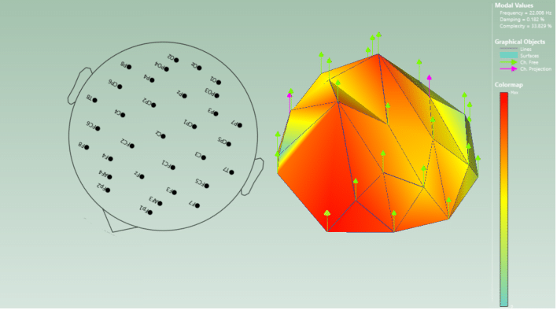
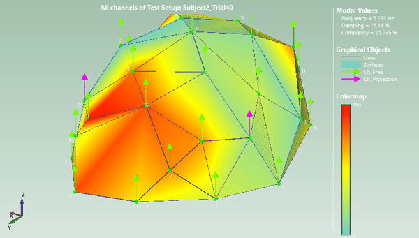

# System Identification Methods for Dynamic Models of Brain Activity


 
==============================

This repo is the implementation of our paper *System Identification Methods for Dynamic Models of Brain Activity*.
> [**System Identification Methods for Dynamic Models of Brain Activity**](https://arxiv.org/abs/1912.12294)    
> Tristan Griffith, James Hubbard,        
> [Biomedical Signal Processing and Control](https://www.robot-learning.org)      
> _doi_

## Reference
If you find this repo to be useful in your research, please consider citing our work
```
@inproceedings{chen2019lbc,
  author    = {Dian Chen and Brady Zhou and Vladlen Koltun and Philipp Kr\"ahenb\"uhl},
  title     = {Learning by Cheating},
  booktitle = {Conference on Robot Learning (CoRL)},
  year      = {2019},
}
```

## Quick Start
### Download Data
- DEAP data: The DEAP data set is publicly available, but requires access request [here](http://anaxagoras.eecs.qmul.ac.uk/request.php?dataset=DEAP).
- EEGMMI data: Download the EEGMMI data set into the src/data folder of this repository using: ```wget -r -N -c -np https://physionet.org/files/eegmmidb/1.0.0/```
### Create environment
```conda env create -f environment.yml```
```conda activate eegID```

### Generate Features
- 

### Run Classification Model

# Project Organization
------------

    ├── LICENSE
    ├── README.md          <- The top-level README for developers using this project.
    ├── data
    │   ├── external       <- Data from third party sources.
    │   ├── interim        <- Intermediate data that has been transformed.
    │   ├── processed      <- The final, canonical data sets for modeling.
    │   └── raw            <- The original, immutable data dump.
    │
    ├── references         <- Data dictionaries, manuals, and all other explanatory materials.
    │
    ├── reports            <- Generated analysis as HTML, PDF, LaTeX, etc.
    │   └── figures        <- Generated graphics and figures to be used in reporting
    │
    ├── requirements.txt   <- The requirements file for reproducing the analysis environment, e.g.
    │                         generated with `pip freeze > requirements.txt`
    │
    ├── src                <- Source code for use in this project.
    │   ├── __init__.py    <- Makes src a Python module
    │   │
    │   ├── data           <- Scripts to download or generate data
    │   │   └── make_dataset.py
    │   │
    │   ├── features       <- Scripts to turn raw data into features for modeling
    │   │   └── build_features.py
    │   │
    │   ├── models         <- Scripts to train models and then use trained models to make
    │   │   │                 predictions
    │   │   ├── predict_model.py
    │   │   └── train_model.py
    │   │
    │   └── visualization  <- Scripts to create exploratory and results oriented visualizations
    │       └── visualize.py
    │
    └── tox.ini            <- tox file with settings for running tox; see tox.readthedocs.io


--------

<p><small>Project based on the <a target="_blank" href="https://drivendata.github.io/cookiecutter-data-science/">cookiecutter data science project template</a>. #cookiecutterdatascience</small></p>
